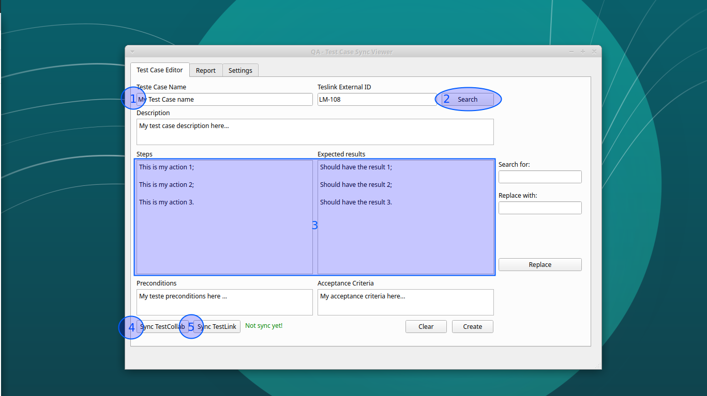

# QA-Test-Viewer

A tool for easily update tests cases on Testlink and TestCollab simultaneouly.

## Instalation

> chmod +x install.sh && ./install.sh

## Update the Credentials 

You should replace the access credentials in the files 'api/testcollabapi.py' and
'api/testlinkapi.py' by your credentials.

## Settings

1. Load the projects;
2. Select the project on Testlink;
3. Select the same project to sync on TestCollab;
4. Save the settings

## Updating a Test Case

1. Type the Test Case name;
2. Click on the button 'Search';
3. Edit the 'actions' and 'results' each one separated by one newline;
4. Click on the button 'Sync TestCollab';
5. Click on the button 'Sync Testlink'.